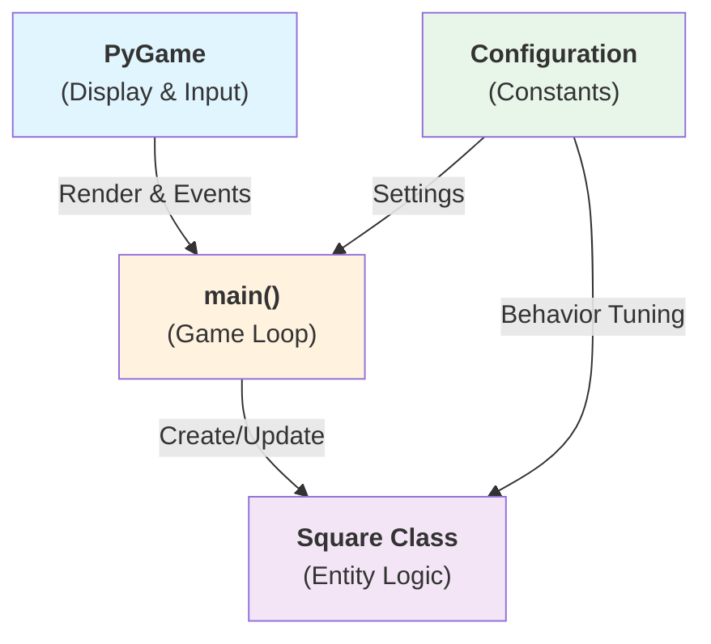
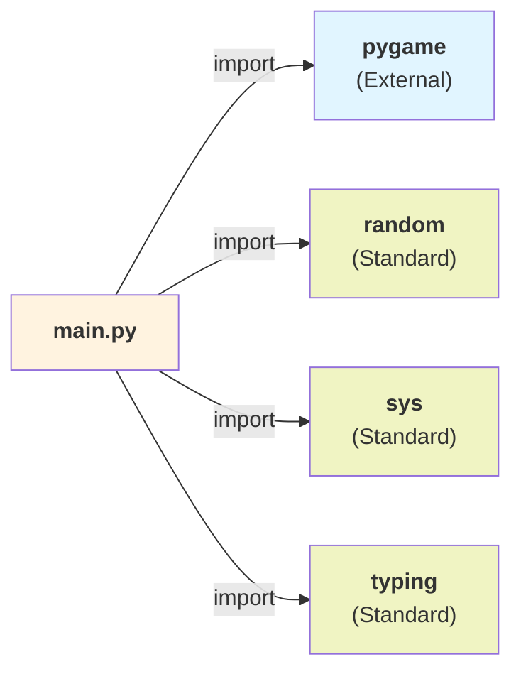
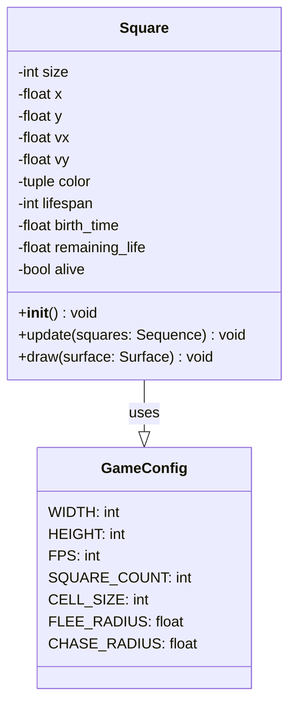
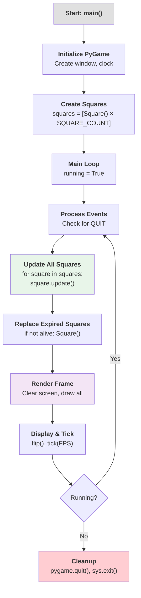
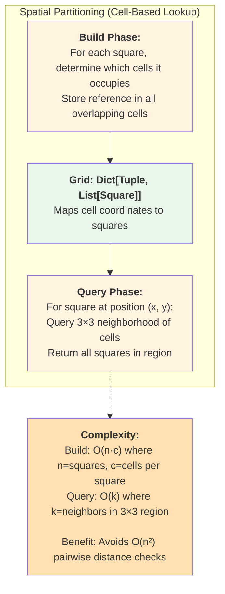
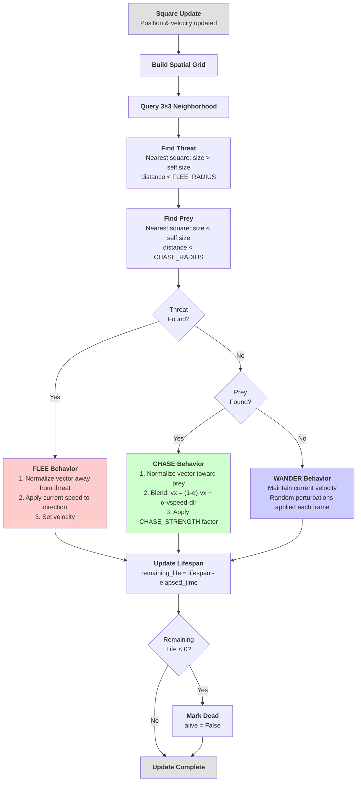
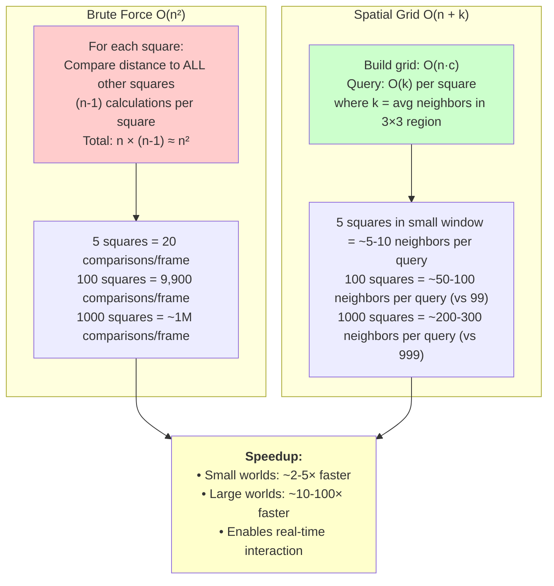

# Pygame Predator-Prey Simulation - Architecture Documentation

## Overview

This project implements a **predator-prey simulation** using Pygame. Entities (colored squares) of varying sizes are placed in a 2D grid where they chase smaller neighbors and flee from larger ones. The system uses **spatial partitioning** to optimize neighbor detection from O(n²) to O(k), enabling efficient real-time animation.

**Core Features:**
- Dynamic square creation and lifespan management
- Size-based predator/prey relationships
- Spatial grid acceleration for neighbor queries
- Steering behaviors: flee, chase, wander
- Edge-bounce collision handling

---

## System Architecture Diagram



---

## Module Dependency Graph



---

## Class Structure Diagram



---

## High-Level Game Loop Flow



---

## Square Update Sequence Diagram

```mermaid
sequenceDiagram
    participant Game as "Main Loop"
    participant Square as "Square Instance"
    participant Grid as "Spatial Grid"
    participant Neighbors as "Neighbor List"
    
    Game->>Square: update(squares)
    activate Square
    
    Square->>Square: Apply random velocity change
    Square->>Square: Advance position by velocity
    Square->>Square: Bounce off edges if needed
    
    Note over Square: Build Spatial Grid
    Square->>Grid: Create cell→square mapping<br/>for all squares
    
    Note over Square: Query Neighborhood
    Square->>Grid: Query 3×3 cells<br/>around current position
    Grid-->>Square: Return neighbors in region
    
    Note over Square: Detect Threats &amp; Prey
    Square->>Neighbors: Find closest larger square<br/>(threat) within FLEE_RADIUS
    Square->>Neighbors: Find closest smaller square<br/>(prey) within CHASE_RADIUS
    
    Note over Square: Steering Logic
    alt Threat exists
        Square->>Square: Flee away from threat<br/>(normalize + apply speed)
    else Prey exists
        Square->>Square: Chase prey<br/>(blend velocity with chase dir)
    else No threat or prey
        Square->>Square: Continue wandering
    end
    
    Square->>Square: Update remaining_life
    Square->>Square: Mark dead if expired
    
    deactivate Square
    Square-->>Game: State updated
```

---

## Spatial Grid Neighbor Detection



---

## Steering Behavior Decision Tree



---

## Data Flow: Initialization → Simulation

```mermaid
graph LR
    subgraph "Initialization Phase"
        Init["<b>pygame.init()</b>"]
        Window["<b>Create Window</b><br/>800×600px"]
        Clock["<b>Create Clock</b><br/>FPS Controller"]
    end
    
    subgraph "Creation Phase"
        CreateList["<b>squares = []</b>"]
        Loop["<b>for i in range(5):</b><br/>Square()"]
    end
    
    subgraph "Per-Square Creation"
        Size["<b>Random Size</b><br/>[10, 60]"]
        Pos["<b>Random Position</b><br/>within bounds"]
        Color["<b>Random Color</b><br/>RGB(50-255, 50-255, 50-255)"]
        Vel["<b>Velocity</b><br/>Speed ∝ 1/size"]
        Life["<b>Random Lifespan</b><br/>[5, 20] seconds"]
    end
    
    subgraph "Simulation Loop"
        Update["<b>square.update()</b>"]
        Draw["<b>square.draw()</b>"]
        Replace["<b>Replace if expired</b>"]
    end
    
    Init --> Window
    Window --> Clock
    Clock --> CreateList
    CreateList --> Loop
    Loop --> Size
    Size --> Pos
    Pos --> Color
    Color --> Vel
    Vel --> Life
    Life --> Update
    Update --> Draw
    Draw --> Replace
    Replace -->|New Square| Loop
    
    style Initialization fill:#e3f2fd
    style "Creation Phase" fill:#e8f5e9
    style "Per-Square Creation" fill:#fff3e0
    style "Simulation Loop" fill:#f3e5f5
```

---

## Performance Optimization: Spatial Grid vs Brute Force



---

## Configuration Parameters & Tuning

| Category | Parameter | Default | Purpose |
|----------|-----------|---------|---------|
| **Display** | WIDTH | 800 | Window width (pixels) |
| | HEIGHT | 600 | Window height (pixels) |
| | FPS | 60 | Target frames per second |
| **Entities** | SQUARE_COUNT | 5 | Number of squares |
| | SQUARE_SIZE_MIN | 10 | Smallest square side (pixels) |
| | SQUARE_SIZE_MAX | 60 | Largest square side (pixels) |
| | MAX_SPEED | 30 | Maximum velocity magnitude |
| **Behavior** | FLEE_RADIUS | 50 | Distance to detect threats |
| | CHASE_RADIUS | 80 | Distance to detect prey |
| | CHASE_STRENGTH | 0.2 | Steering blend factor (0.0-1.0) |
| | VELOCITY_CHANGE_CHANCE | 0.03 | Random direction change probability |
| **Lifecycle** | MIN_LIFESPAN | 5 | Minimum lifetime (seconds) |
| | MAX_LIFESPAN | 20 | Maximum lifetime (seconds) |
| **Grid** | CELL_SIZE | 100 | Grid cell size (pixels) |

---

## File Structure

```
lab8-pygame/
├── main.py                  # Entry point: game loop, Square class, configuration
├── requirements.txt         # Dependencies (pygame-ce)
├── docs/
│   ├── architecture.md      # This file
│   └── architecture.html    # Static HTML version
└── README.md                # Setup and run instructions
```

---

## Key Algorithms & Techniques

### 1. **Spatial Grid Partitioning**
- Divides the 800×600 window into 100×100 pixel cells
- Each square registers itself in all cells it occupies
- Neighbor queries use only 3×3 local cell neighborhood
- Result: O(k) neighbor detection vs O(n²) brute force

### 2. **Steering Behaviors**
- **Flee:** Normalize vector pointing *away* from threat, apply speed
- **Chase:** Blend current velocity with direction to prey using `CHASE_STRENGTH` factor
- **Wander:** Continue with random perturbations when no threat/prey detected

### 3. **Lifespan Management**
- Each square has random lifespan (5-20 seconds)
- Remaining life decremented each frame based on elapsed time
- Dead squares are replaced with fresh instances immediately

### 4. **Edge Bouncing**
- Squares reflect off window boundaries
- Velocity component inverted when collision detected
- Position clamped to prevent over-penetration

### 5. **Velocity Normalization**
- Ensures consistent movement speed regardless of distance to target
- Critical for stable steering and predictable behavior

---

## Complexity Analysis

| Operation | Time | Space | Notes |
|-----------|------|-------|-------|
| Build spatial grid | O(n·c) | O(n·c) | n=squares, c=cells per square (typically 1-4) |
| Query neighborhood | O(k) | O(k) | k=neighbors in 3×3 region (typically 5-50) |
| Update square position | O(1) | O(1) | Basic arithmetic |
| Frame render | O(n) | O(1) | One draw call per square |
| **Total per frame** | **O(n·c + k)** | **O(n·c)** | Scales linearly with square count in practice |
| Brute force alternative | O(n²) | O(1) | Pairwise distance check (much slower) |

---

## Simulation Dynamics

**Predator-Prey Balance:**
- Larger squares (predators) actively chase smaller ones
- Smaller squares (prey) flee from larger threats
- Random size distribution creates natural hierarchy
- Continuous replacement prevents extinction

**Emergent Behaviors:**
- Clustering: Similar-sized squares tend to form loose groups
- Hunting patterns: Predators track individual prey in pursuit
- Evasion: Prey use random direction changes to escape
- Population stability: Lifespan system maintains ~5 squares at all times

---

## Future Enhancement Opportunities

1. **Multi-threaded grid updates** for large square counts (100+)
2. **Collision detection** preventing square overlap
3. **Energy/hunger system** where chasing costs stamina
4. **Reproduction** when predators catch prey
5. **Mutation** system for evolving behaviors across generations
6. **Visualization modes** (heatmaps, predator/prey color coding, trajectory trails)

---

## References

- **Spatial Partitioning:** Classic optimization for n-body systems; reduces collision/neighbor queries from O(n²) to O(n + k)
- **Steering Behaviors:** Craig Reynolds' work on flocking and autonomous agents
- **Pygame Documentation:** https://www.pygame.org
